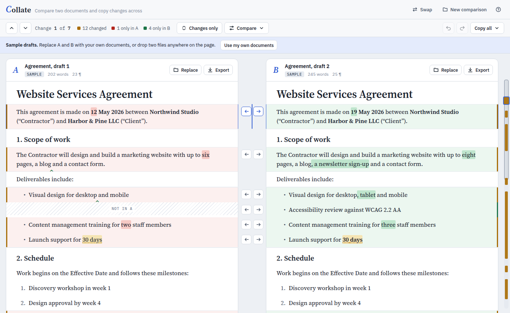

# Collate

Compare two versions of a Word or Google Docs document side by side, see every difference down to the word, and copy changes from one version to the other. Collate runs entirely in your browser. Documents are never uploaded.



## What you can do

- **Load documents** as **A** and **B**:
  - Word files (`.docx`). This is also the best way in for Google Docs: *File › Download › Microsoft Word (.docx)*.
  - Rich text pasted straight from Google Docs or Word, with headings, lists, tables, bold, italic and links kept.
  - A Google Docs link: Collate builds the `.docx` download link for you, and private documents work because the download uses your own Google sign-in.
  - `.html`, `.md` and `.txt` files.
  - Drop two files at once and they load as A and B.
- **Compare.** Paragraphs are lined up side by side, and rewritten paragraphs are paired with their counterpart instead of showing as removed and added. Inside a paragraph, words only in A are red, words only in B are green, and a caret marks where the other side has extra text. Formatting-only changes (bold, italic, link targets, heading level, list type, alignment) are flagged separately. Tables are compared row by row and cell by cell. Images, footnote text, fields and equations count too.
- **Copy changes across**, in either direction:
  - a whole paragraph (the arrows between the columns);
  - a single word-level edit (click a highlighted word);
  - a single table row, or the whole table;
  - the current change (<kbd>Alt</kbd>+<kbd>→</kbd> / <kbd>Alt</kbd>+<kbd>←</kbd>);
  - everything (*Copy all › Make B match A*).

  Every copy can be undone and redone.
- **Get the result out** (*Export* on either side):
  - **Download Word document.** When the side was loaded from a `.docx`, the original file is kept and only the copied paragraphs change. Styles, headers, footers, page setup, comments, bookmarks and content controls all stay. Copied content brings its images, links, styles, list numbering and footnotes with it.
  - **Copy formatted text**, to paste into Google Docs or Word.
  - HTML, Markdown or plain text.

### Round trip with Google Docs

1. Get each version in. Either download it as `.docx` (*File › Download › Microsoft Word*) and load the file, or select everything in the doc, copy it, and use *Replace › Paste from Google Docs or Word*.
2. Copy the changes you want.
3. Take the result back to Google Docs in one of two ways:
   - *Export › Download Word document*, then in Google Docs use *File › Open › Upload*. You can also upload the file to Drive and open it with Google Docs.
   - *Export › Copy formatted text*, then select all in the Google Doc and paste over it.

### Options

*Compare* sets what counts as a difference:

- word-by-word or character-by-character marking;
- ignore empty paragraphs (on by default);
- ignore formatting, letter case, extra spaces, or curly versus straight quotes and dashes.

*Changes only* folds unchanged paragraphs away. The strip on the right edge shows where every change is; click it to jump.

### Keyboard

| Keys | Action |
| --- | --- |
| <kbd>N</kbd> / <kbd>P</kbd> (or <kbd>J</kbd> / <kbd>K</kbd>) | Next / previous change |
| <kbd>Alt</kbd>+<kbd>→</kbd> | Use A's version of the current change in B |
| <kbd>Alt</kbd>+<kbd>←</kbd> | Use B's version of the current change in A |
| <kbd>Ctrl</kbd>/<kbd>⌘</kbd>+<kbd>Z</kbd>, <kbd>Ctrl</kbd>/<kbd>⌘</kbd>+<kbd>Shift</kbd>+<kbd>Z</kbd> | Undo, redo |
| <kbd>C</kbd> | Changes only |
| <kbd>?</kbd> | Help |

### What is and isn't compared

- The document body is compared: paragraphs, headings, lists, tables (including nested ones), links, images, footnote and endnote text, fields and equations. Headers, footers and comments are not compared, and they stay in the exported file.
- Tracked changes are compared as if they were all accepted. They are kept as they are when you export.
- A paragraph that moved shows as removed in one place and added in another.
- Old `.doc`, `.odt`, `.rtf` and PDF files aren't read. Save them as `.docx` first.
- The Google Docs link option can't fetch the document by itself, because browsers block that. It gives you a one-click download instead.

## Running it

It is a static site with no backend.

```sh
npm install
npm run dev          # http://localhost:5173
npm run build        # static site in dist/
npm run build:single # one self-contained file: dist-single/collate.html
```

`dist-single/collate.html` works when opened straight from disk, so you can share it as a single file.

### GitHub Pages

`.github/workflows/pages.yml` builds and deploys the site on every push to `main`. Turn it on once under *Settings › Pages › Build and deployment › Source: GitHub Actions*.

## Tests

```sh
npm test            # unit tests (Vitest + jsdom)
npm run test:e2e    # browser tests (Playwright + Chromium)
npm run typecheck
```

The Word tests merge real `.docx` fixtures in both directions. They check every result for structural problems Word is strict about: relationships, content types, unique drawing ids, numbering order, and comment and footnote references. They then open the file with [python-docx](https://python-docx.readthedocs.io/) (`pip install python-docx`) and, when it is installed, convert it with LibreOffice.

Fixtures are generated by `python3 scripts/make_fixtures.py`. `python3 scripts/make_large_fixture.py tests/fixtures/out` generates two 3,000-paragraph documents for the opt-in benchmark in `tests/unit/perf.bench.test.ts`.

## How it works

```
src/
  core/            format-neutral model and algorithms
    model.ts       blocks (paragraphs, tables), spans, formatting
    tokens.ts      tokenizer, normalization, block signatures
    myers.ts       linear-space Myers diff
    align.ts       pairs similar paragraphs inside a change
    inline.ts      word-level diff with semantic cleanup
    compare.ts     aligned rows, table row diffs, hunks, stats
    merge.ts       applies a selection of changes in one direction
  formats/
    docx/          .docx reader, writer and merge backend
    html/          pasted/HTML reader, HTML/Markdown/text export
    text/          Markdown and plain-text readers
  ui/              app shell, aligned grid, rendering
```

- **Comparison.** Each paragraph gets a signature from its style and tokens, and the two paragraph sequences are diffed with Myers' algorithm. Within each changed region, a small dynamic program pairs up paragraphs whose words overlap enough. Paired paragraphs are then diffed word by word. The cleanup step folds short common stretches into a single edit, so a rewritten phrase reads as one change.
- **Merging.** A merge rebuilds the target's block list from the aligned rows. Paragraphs the comparison ignores, such as empty lines and bookmarks, stay where they are.
- **Word files.** Word documents keep their original XML. Copying a paragraph imports its XML into the other package and remaps relationship ids, media, styles (matched by name), numbering (so lists continue), footnotes, drawing ids and namespaces. A word-level copy rebuilds just that paragraph from pieces of both originals, keeping each piece's run formatting.
