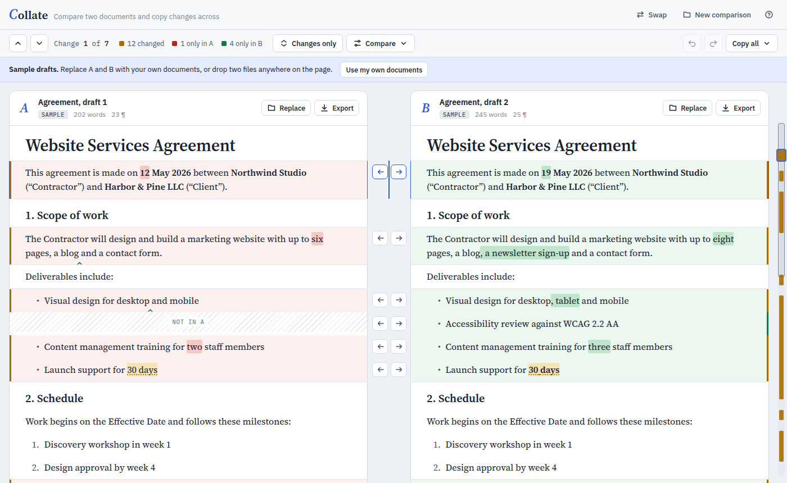

# Collate

Compare two versions of a document side by side, see every difference down to the word, and copy changes from one version to the other. Word, Google Docs, PDF, OpenDocument, RTF, EPUB, web pages, Markdown, CSV and plain-text files all work, and the two versions don't have to be in the same format. Collate runs entirely in your browser. Documents are never uploaded.



## What you can do

- **Choose what you are comparing first** — documents, images or audio — then one file, or both versions at once. The toolbar, the column heads and the view then fit that kind of file.
- **Load documents** as **A** and **B**:
  - Word files (`.docx`). This is also the best way in for Google Docs: *File › Download › Microsoft Word (.docx)*.
  - Rich text pasted straight from Google Docs or Word, with headings, lists, tables, bold, italic and links kept.
  - A Google Docs link: Collate builds the `.docx` download link for you, and private documents work because the download uses your own Google sign-in.
  - OpenDocument text (`.odt`, and flat `.fodt`) from LibreOffice, Collabora or OnlyOffice.
  - PDF. A PDF stores laid-out text rather than paragraphs, so Collate rebuilds the document: from the PDF's structure tags when it has them (Word, LibreOffice and most modern tools write them), otherwise from the layout of each page. Headings, lists, tables, links, footnotes and tables of contents come back, and running headers, footers and page numbers are left out.
  - Rich Text (`.rtf`), old Word 97–2003 files (`.doc`) and EPUB books.
  - Web pages (`.html`, `.mht`), Markdown and plain text.
  - CSV and TSV files, compared row by row as tables.
  - Code, data and config files (`.json`, `.xml`, `.yaml`, `.tex`, `.py` and many more), compared line by line in a monospace font.
  - Pictures (`.png`, `.jpg`, `.gif`, `.webp`, `.svg`, `.bmp`), compared as pictures (see *Pictures* below).
  - Recordings (`.mp3`, `.wav`, `.m4a`, `.aac`, `.ogg`, `.opus`, `.flac`, `.webm`), compared as sound (see *Audio* below).
  - From Google Drive, OneDrive or Dropbox, when the site is set up with their keys (see *Cloud drives*).
  - Files are recognized by their content, so a `.doc` that is really RTF or a web page still loads.
  - Drop two files at once and they load as A and B. Drop (or choose) more than two and they are **versions** of one document: see *Versions* below.
- **Compare.** Rewritten paragraphs are paired with their counterpart instead of showing as removed and added. Inside a paragraph, words only in A are red, words only in B are green, and a caret marks where the other side has extra text. Formatting-only changes (bold, italic, link targets, heading level, list type, alignment) are flagged separately. Tables are compared row by row and cell by cell. Images, footnote text, fields and equations count too.
- **Three ways to read the comparison.**
  - *Side by side with connection bands* (the default): each document runs on unbroken in its own column, as in Meld or a JetBrains IDE. As the page scrolls, the columns slide against each other so that what is level with the middle of the screen matches, and a band across the gutter joins each change to the other side (a line marks where text is missing).
  - *Side by side in rows* (connection bands off): paragraphs are lined up in rows, with a gap where one side has nothing.
  - *Unified*: one column, with A's version above B's wherever they differ. On a phone it is the only view.
- **Find your way.** The ruler between the columns has a mark for every change: click a mark to go to it, or drag its frame (the part of the documents on screen) to scroll. The minimap draws each document in miniature on either side of the ruler. The list of changes names every change with its words, and how many words are only in A (−) and only in B (+); click one to go there. Buttons step to the next or previous change or page, and are greyed out where there is nowhere to go. When A and B match, the toolbar turns green.
- **Copy changes across**, in either direction:
  - a whole paragraph (the arrows either side of the ruler; with connection bands, the arrows at the ends of a band copy the whole change);
  - a single word-level edit (click a highlighted word);
  - a single table row, or the whole table;
  - the current change (<kbd>Alt</kbd>+<kbd>→</kbd> / <kbd>Alt</kbd>+<kbd>←</kbd>);
  - everything (*Copy changes › Make B match A*).

  Every copy can be undone and redone.
- **Pick up where you left off.** Reloading the page keeps both documents, every change copied between them and your place in them. The comparison is kept in this browser only (IndexedDB), one per tab; opening the comparison page afresh carries on with the most recent one. An unedited document is kept as its file, an edited Word or OpenDocument file with the copied changes written in, and anything else as the document itself. The undo history starts again after a reload.
- **Get the result out** (*Export* on either side). A document is offered in its own format first:
  - **Word** and **OpenDocument**: when the side was loaded from a `.docx` or `.odt`, the original file is kept and only the copied paragraphs change. Styles, headers, footers, page setup, comments, bookmarks and content controls all stay. Copied content brings its images, links, styles, list numbering and footnotes with it, even between Word and OpenDocument files.
  - **CSV/TSV** and code or data files are saved in their own format, with their separator and line endings.
  - Any document can also be saved as a new Word, OpenDocument, RTF or PDF file, a web page, Markdown or plain text. EPUB and `.doc` files are read only, so they are saved in one of these formats.
  - **PDF**: the document is laid out afresh on A4 pages, in Roboto (Latin, Greek and Cyrillic) with Courier for code. The table of contents shows the pages its headings land on in the new PDF and links to them, page-number fields are filled in, and footnotes are listed as notes at the end. The PDF maker, [pdfmake](https://pdfmake.github.io/docs/), is loaded from jsDelivr the first time a PDF is saved, so that needs an internet connection. Only the library is downloaded; the document never leaves the browser.
  - **Print…** prints just that document, cleanly laid out. It isn't offered where the page can't open the print dialog (such as the Claude artifact viewer).
  - **Copy formatted text**, to paste into Google Docs or Word.

### Reviewing

- **Review mode** (<kbd>R</kbd>) adds a margin outside each document. Select text to highlight it or note on it; mark a change *Looks right*, *Needs work* or *Idea*. Hovering over noted or highlighted text shades it; clicking it opens its card in the margin.
- **Right-click menus.** Right-click a highlight or note, selected text, a changed word or anywhere in a changed paragraph for everything that can be done there: highlight, note, react, accept or reject, copy the text, use one side's version in the other, compare pictures, and follow a moved paragraph. <kbd>Shift</kbd>+right-click keeps the browser's own menu.
- **Accept and reject** each change (<kbd>A</kbd> / <kbd>X</kbd> accept or reject the current change and go to the next; also in the list of changes and the menus). The list shows how many are decided, and can show only the open ones or only flagged ones. *Apply decisions to B* puts A's text back wherever a change was rejected.
- **Flags** mark what a change touches, worked out in the browser: amounts, dates and periods, obligations, parties, defined terms, and text removed outright.
- **What matters.** In the Claude app, *Summarise with Claude* (in the list of changes) sends the changed words to Claude and lists the changes that change the meaning, each linked to its changes. Nothing is sent until you ask.
- **Moved paragraphs** are recognised, when they are the same or nearly the same, and shown as moved (with where they went) rather than as removed and added.
- **Spelling, grammar and contract checks** (<kbd>G</kbd>): misspellings are underlined in red and grammar slips in blue (with Claude's suggestions too, in the Claude app). Contract checks, underlined in purple, find cross-references to clauses that aren't there, defined terms never used or used after their definition went, amounts whose words and figures disagree, and parties spelled two ways or renamed in only some places. Click an underline for the fix.

### Getting a review out

- **Redline** (the download button in the toolbar): a Word file of B with every change from A as a **tracked change**, the way Word shows them. Accept them all to get B, reject them all to get A. Moved paragraphs are Word moves, formatting-only changes show as "Formatted", and your notes, reactions and decisions go in as **Word comments** on their words or change, under your name. It is built on B's own file when B is a Word file, so its page setup, headers and styles stay. *As a PDF instead* gives a read-only redline, added text in green and removed text struck through in red, with the notes listed at the end.
- **Change report** (as PDF or Word): the totals, Claude's summary when there is one, a table of every change with its decision, flags, reactions and notes, then each change with its words before and after. It can list only the open changes, or only those with notes, with the paragraphs around them.
- **Review file** (*Share*): both documents, any other versions and the whole review (notes, highlights, reactions, decisions, ignored spellings, Claude's suggestions) in one `.collate` file, optionally locked with a password (AES-GCM; the key comes from the password through PBKDF2). Whoever opens it in Collate carries on where you left off. Your name goes on your notes and changes.

### Versions

Load several drafts at once and they are kept in the order of their names (v2 before v10); the last two are compared. The version bar steps through the pairs (1 with 2, 2 with 3, …) or compares any two, and *History across the versions* (in a change's menu) shows one paragraph in every draft, with what was added each time. A file opened from Google Drive can be compared with its own earlier versions (*Replace › Compare with an earlier version*).

### Pictures

Two picture files are compared as pictures, with the picture tools in the toolbar: **side by side**, **swipe** (drag the handle, or the slider under the pictures), **onion skin** (one faded over the other) and **difference** (changed pixels in red over a faded picture). Zoom and pan stay in step (<kbd>Ctrl</kbd>/<kbd>⌘</kbd>+wheel zooms, drag pans, <kbd>1</kbd>–<kbd>4</kbd> switch modes); the changed areas are outlined and can be stepped through (<kbd>N</kbd>/<kbd>P</kbd>, zoomed in on each), a sensitivity slider sets how small a difference counts, and the difference can be saved as a PNG. Which picture is on top in swipe, onion skin and difference can be swapped (<kbd>X</kbd>). **Notes** (<kbd>C</kbd>): drag over an area of either picture, or click a point, and write on it; the notes are listed in the pane (<kbd>S</kbd>), and clicking one zooms to it. The column heads give each picture's size in pixels and its file size. Pictures inside documents open the same tools and view in a dialog when clicked, and the list of changes shows them as thumbnails. A picture is recognised by what it shows, so one that was only resized or saved again is not a change.

### Audio

Two recordings are compared as sound. They are lined up in time first (so a pause or phrase added in one doesn't make everything after it different), then:

- **The tracks**, A over B on one time scale, as a **waveform**, a **spectrogram** (the pitches over time) or **loudness**, with each difference marked on both and joined by a band between them: *sounds different*, *only in A*, *only in B*.
- **Playback** under the tracks: the time, a scrubber with the differences marked on it, the length, and the controls — the transcript, **A/B** (switches to the other recording at the same moment of the recording), previous difference, play, next difference, loop the difference, the speed and the volume. Clicking a track, a difference or a transcript word plays from there.
- **A sensitivity** slider (how small a difference counts), and the pane (<kbd>S</kbd>) listing the differences with their times.
- **Scrubbing**: drag along the playback bar, a track or a playhead; turn on *hear while scrubbing* to hear it as you go. The ruler over the tracks frames the part in view: drag it to scroll, drag its ends to zoom.
- **Transcripts**: *Transcribe* runs a speech model (Whisper tiny, with word timings) **on this device** — nothing is sent anywhere — and compares what was said, in the same side-by-side rows as documents; the pane lists the changed words beside the changed sounds. Where a transcription server is set up, the menu beside *Transcribe* can send the recordings there instead (faster, with a larger model) — only after the reader agrees.
- **Notes** (<kbd>C</kbd>): drag along a track to mark a stretch, or click a moment, and write on it; they are listed in the pane's Notes tab.
- Beside each track: the recording, its format, and its Replace and Export menus; over it, its sample rate, channels, length and file size.

The speech model is 41 MB. `npm run models` downloads it (with the ONNX Runtime it runs on) into `public/`, so the site serves it itself and transcription works offline; without it, the model is downloaded from Hugging Face the first time it is used, and kept by the browser.

#### Transcribing on a server

`server/transcribe/` is an optional Go service that runs [whisper.cpp](https://github.com/ggml-org/whisper.cpp) for the site. It keeps nothing: each recording is transcribed from a private temporary folder that is removed before it answers.

```sh
brew install whisper-cpp   # or build whisper.cpp and set WHISPER_BIN
npm run server:model       # ggml-base (142 MB) into server/transcribe/models/
npm run server             # :8787; ALLOWED_ORIGINS, WORKERS, MAX_MINUTES, WHISPER_MODEL to change
```

Start the site with `TRANSCRIBE_URL=http://127.0.0.1:8787` in its environment (or `.env.local`): its `/api/transcribe` route passes recordings on to the service, so the service needn't be reachable from outside. The page asks the route whether transcription is offered, so it appears as soon as the service is up, with no rebuild.

### Cloud drives

Opening files from Google Drive, OneDrive and Dropbox uses each service's own picker, and needs the site's own keys at build time (a service without keys isn't offered). Copy `.env.local.example` to `.env.local`: it lists the variables and, for each service, where its keys come from.

| Variable | Service |
| --- | --- |
| `NEXT_PUBLIC_GOOGLE_CLIENT_ID`, `NEXT_PUBLIC_GOOGLE_API_KEY` (and optionally `NEXT_PUBLIC_GOOGLE_APP_ID`) | Google Drive (OAuth client for the site's origin, with the Picker and Drive APIs enabled; the `drive.file` scope only reaches the files you pick) |
| `NEXT_PUBLIC_ONEDRIVE_CLIENT_ID` | OneDrive (an Azure app registration) |
| `NEXT_PUBLIC_DROPBOX_APP_KEY` | Dropbox (a Chooser app key for the site's domain) |

The single-file build reads the same keys from `window.COLLATE_CONFIG = { google: { clientId, apiKey }, onedrive: { clientId }, dropbox: { appKey } }`. Files come straight from the service to the browser.

### Installing it

The site can be installed as an app (the browser's *Install* button). It then works offline once opened: a service worker keeps the pages and, once used, the PDF library. On the desktop, Chromium browsers offer *Open with Collate* for documents.

### Round trip with Google Docs

1. Get each version in. Either download it as `.docx` (*File › Download › Microsoft Word*) and load the file, or select everything in the doc, copy it, and use *Replace › Paste from Google Docs or Word*.
2. Copy the changes you want.
3. Take the result back to Google Docs in one of two ways:
   - *Export › Download Word document*, then in Google Docs use *File › Open › Upload*. You can also upload the file to Drive and open it with Google Docs.
   - *Export › Copy formatted text*, then select all in the Google Doc and paste over it.

### Options

*Compare* sets what counts as a difference:

- word-by-word or character-by-character marking;
- ignore empty paragraphs (on by default);
- ignore formatting, letter case, extra spaces, or curly versus straight quotes and dashes.

The toolbar has three parts:

- **Changes**, on the left: previous and next change, *Changes only* (which folds unchanged paragraphs away), and the totals behind the ⓘ icon (hover or click it).
- **View**, in the middle: side by side or unified, the minimap, line numbers in the gutter (paragraph numbers, which for text and code files are their line numbers), connection bands, *Compare* options, and *Previous page* / *Next page*.
- **Editing**, on the right: undo, redo, *Copy changes* and the list of changes.

The counter ("3/7": the third of seven changes) sits between the column heads, above the ruler. View settings are remembered in the browser. In the app bar, the low contrast button drops the borders and lines (all but the one under the column heads) so the sheets and the desk share one colour, and the theme button switches between light and dark. The theme applies to every page and is remembered; picking the system's own theme again goes back to following the system. Notes about the documents (such as a PDF not being editable in place) can be dismissed.

### Keyboard

| Keys | Action |
| --- | --- |
| <kbd>N</kbd> / <kbd>P</kbd> (or <kbd>J</kbd> / <kbd>K</kbd>) | Next / previous change |
| <kbd>Page Down</kbd> / <kbd>Page Up</kbd> | Next / previous page |
| <kbd>Alt</kbd>+<kbd>→</kbd> | Use A's version of the current change in B |
| <kbd>Alt</kbd>+<kbd>←</kbd> | Use B's version of the current change in A |
| <kbd>Ctrl</kbd>/<kbd>⌘</kbd>+<kbd>Z</kbd>, <kbd>Ctrl</kbd>/<kbd>⌘</kbd>+<kbd>Shift</kbd>+<kbd>Z</kbd> | Undo, redo |
| <kbd>A</kbd> / <kbd>X</kbd> | Accept / reject the current change and go to the next |
| <kbd>R</kbd> | Review mode |
| <kbd>G</kbd> | Spelling, grammar and contract checks |
| <kbd>C</kbd> | Changes only |
| <kbd>V</kbd> | Side by side / unified |
| <kbd>B</kbd> | Connection bands |
| <kbd>S</kbd> | List of changes |
| <kbd>M</kbd> | Minimap |
| <kbd>L</kbd> | Line numbers |
| <kbd>?</kbd> | Help |

### What is and isn't compared

- The document body is compared: paragraphs, headings, lists, tables (including nested ones), links, images, footnote and endnote text, fields and equations. Headers, footers and comments are not compared, and they stay in the exported file.
- Tracked changes are compared as if they were all accepted. They are kept as they are when you export.
- A paragraph that moved is shown as moved when its text is the same or nearly the same; words or sentences moved inside paragraphs show as removed and added.
- Page numbers and dates inserted as fields compare by what they are, not by the number they happen to show.
- PDFs: pictures can't be matched with another format's (a PDF doesn't keep the original image file), a page number is plain text there, and a PDF that is only a scan has no text to compare. Password-protected PDFs and DRM-protected EPUBs can't be read.
- The Google Docs link option can't fetch the document by itself, because browsers block that. It gives you a one-click download instead.
- Apple Pages, WordPerfect and spreadsheet files aren't read; save them as Word or PDF first.

## Running it

It is a [Next.js](https://nextjs.org) app. The pages are pre-rendered and everything about documents happens in the browser; the server adds API routes (transcription, `/api/transcribe`).

```sh
npm install
npm run models       # optional: the speech model for audio transcripts, served by the site (41 MB)
npm run dev          # http://localhost:3000
npm run build        # the production build (.next/)
npm start            # serves it at http://localhost:3000 (behind nginx or Caddy on a VPS)
npm run build:single # one self-contained file: dist-single/collate.html
```

The site's main pages:

- `/` is the landing page. Dropping a file on it, or choosing one, starts a comparison.
- `/compare/new/` asks for the other version, which must be the same kind of file as the first (Word with Word, PDF with PDF and so on), then opens the two in the workspace. Opened on its own, it asks for both files in turn.
- `/compare/` is the comparison workspace for the two documents chosen there; any two documents, in any mix of formats, can then be loaded in it. The comparison is kept in the browser, so a reload carries on with it; opened directly, it carries on with the most recent comparison, or goes to `/compare/new/` when there is none.
- `/compare/sample/` is the workspace with the sample drafts.
- `/samples/` lists sample documents, pictures and recordings (served from `public/samples/`); each pair opens in the workspace in one click or can be downloaded. `node scripts/make-samples.mjs` regenerates the melody pair; the others are hand-written or copied from `tests/fixtures/`.
- `/guides/` and its walkthroughs (`/guides/documents/`, `/guides/images/`, `/guides/audio/`) pair each step with a working HTML replica of the workspace (`src/components/replica/`): a step outlines its part of the replica, and clicking a part opens its step.
- `/help/` has a searchable FAQ, a "where is it?" finder on the replica and a keyboard-shortcut tester.
- `/privacy/`, `/terms/`, `/cookies/`, `/accessibility/` and `/licenses/` are the legal pages (shared layout and contact link in `src/components/legal-page.tsx`).

`dist-single/collate.html` is the workspace on its own, starting with the sample drafts, built by Vite from `index.html` and `src/main.tsx`. It works when opened straight from disk, so you can share it as a single file (about 1.3 MB, React included). It loads [pdf.js](https://mozilla.github.io/pdf.js/) from jsDelivr the first time a PDF is opened, pinned to the installed version by an import map with integrity hashes; the regular build serves its own copy of pdf.js and loads it only when a PDF is opened. Both builds load pdfmake from jsDelivr (with a subresource integrity check) when a PDF is first saved.

### Deploying

On a VPS: `npm ci && npm run build`, then run `npm start` (with `PORT` and, for transcription, `TRANSCRIBE_URL`) under a process manager such as systemd or pm2, behind a reverse proxy for HTTPS. `BASE_PATH` serves the site from a sub-path. Run the transcription service beside it (`npm run server`, or its built binary: `cd server/transcribe && go build`).

## Tests

```sh
npm test            # unit tests (Vitest + jsdom)
npm run test:e2e    # browser tests (Playwright + Chromium)
npm run typecheck
```

The Word tests merge real `.docx` fixtures in both directions. They check every result for structural problems Word is strict about: relationships, content types, unique drawing ids, numbering order, and comment and footnote references. They then open the file with [python-docx](https://python-docx.readthedocs.io/) (`pip install python-docx`) and, when it is installed, convert it with LibreOffice.

The OpenDocument tests do the same for `.odt` files (manifest, stored `mimetype` entry, style references, unique names) and open every result with LibreOffice. The PDF, RTF, `.doc` and EPUB readers are checked against the Word originals they were converted from: apart from what a format can't carry, they must read the same. Saved PDFs are made with pdfmake's Node build and read back with the PDF reader, and the browser test checks that pictures are embedded intact.

Fixtures are generated by `python3 scripts/make_fixtures.py`, which also runs `scripts/convert_fixtures.py` to convert them with LibreOffice into the other formats. `python3 scripts/make_large_fixture.py tests/fixtures/out` generates two 3,000-paragraph documents for the opt-in benchmark in `tests/unit/perf.bench.test.ts`.

## How it works

`docs/ARCHITECTURE.md` is the map: how text, images and audio each plug in (a controller, tools and a view per kind), and how to add another.

```
src/
  app/             Next.js pages: the landing page, /compare, /compare/new and /compare/sample
  components/      the site's React components; workspace.tsx shows the workspace from ui/
  lib/handoff.ts   carries the chosen files and documents from page to page
  core/            format-neutral model and algorithms
    model.ts       blocks (paragraphs, tables), spans, formatting
    tokens.ts      tokenizer, normalization, block signatures
    myers.ts       linear-space Myers diff
    align.ts       pairs similar paragraphs inside a change
    inline.ts      word-level diff with semantic cleanup
    compare.ts     aligned rows, table row diffs, hunks, stats
    merge.ts       applies a selection of changes in one direction
    redline.ts     the comparison as one document of tracked changes, and where notes go in it
    moves.ts       moved paragraphs
    versions.ts    drafts in order, and one paragraph through them
  formats/
    load.ts        recognizes files by content and picks a reader
    extensions.ts  the file extensions pickers offer, and which of them are the same kind of file
    export.ts      the formats each document can be saved in
    docx/          .docx reader, writer and merge backend
    odt/           OpenDocument reader, writer and merge backend
    rtf/           RTF reader and writer
    doc/           Word 97–2003 reader (compound file + Word binary format)
    pdf/           PDF reader (pdf.js + structure tags or layout analysis) and writer (pdfmake)
    epub/          EPUB reader
    html/          pasted/HTML reader, HTML/Markdown/text export
    image/         picture files as documents
    docx/redline.ts  the redline as Word tracked changes, moves and comments
    text/          Markdown, plain-text, CSV/TSV readers and writers
  check/           spelling, grammar, contract checks (contract.ts), Claude's suggestions and summary
  review/          review marks and where they are (anchor.ts, marks.ts, dom.ts), and change flags (risk.ts)
  image/           comparing pictures pixel by pixel (diff.ts) and drawing them (draw.ts)
  audio/           sound: analysis (analyze.ts), time alignment and differences (align.ts), decoding,
                   transcription in a worker (Whisper tiny), transcript diffs (words.ts)
  media/kinds.ts   the kinds of comparison (text, image, audio) and their files
  lib/cloud.ts     Google Drive, OneDrive and Dropbox pickers, and Drive's earlier versions
  ui/              the workspace, in React
    app.tsx        state (documents, undo, view settings) and actions; lays out the rest
    toolbar.tsx    app bar and toolbar
    grid.tsx       the aligned rows (side by side or unified), memoized by row, and keeping the reader's place
    elastic-grid.tsx  side by side with connection bands: each document in its own column
    elastic.ts     lines those columns up as the page scrolls and draws the bands
    overview.tsx   ruler, minimaps and the frame that scrolls the documents
    changes-panel.tsx, menus.tsx, dialogs.tsx, notices.tsx, heads.tsx, counter.tsx,
    empty.tsx, toasts.tsx, drop.tsx, tooltip.tsx
    rows.ts        what each row shows (render.ts turns document text into HTML)
    layout.ts      measuring rows, scrolling to a change, keeping the reader's place
    changes.ts     what the list of changes says about each change
    history.ts, theme.ts, files.ts, export.ts, util.ts, hooks.ts
    review-card.tsx  the margin card and the right-click menus
    image/, audio/   each kind's controller hook, toolbar tools and view (audio: tracks and the playback bar)
    facts.ts       what a column head says, by kind
    report.ts      the change report
    review-file.ts the .collate review file
    versions.tsx, image-compare.tsx, pictures.ts, check-ui.tsx
```

- **Comparison.** Each paragraph gets a signature from its style and tokens, and the two paragraph sequences are diffed with Myers' algorithm. Within each changed region, a small dynamic program pairs up paragraphs whose words overlap enough. Paired paragraphs are then diffed word by word. The cleanup step folds short common stretches into a single edit, so a rewritten phrase reads as one change.
- **Merging.** A merge rebuilds the target's block list from the aligned rows. Paragraphs the comparison ignores, such as empty lines and bookmarks, stay where they are.
- **Connection bands.** The page scrolls through the aligned layout, each line as tall as its taller side, so the scrollbar, the ruler and every jump work as they do with rows. At each scroll position, the line at the sync point (the middle of the screen, moving to the top and bottom at the ends of the documents) is found and each column is shifted so its side of that line is level with it. Between changes neither shift changes, so the page scrolls as it would without them.
- **Word files.** Word documents keep their original XML. Copying a paragraph imports its XML into the other package and remaps relationship ids, media, styles (matched by name), numbering (so lists continue), footnotes, drawing ids and namespaces. A word-level copy rebuilds just that paragraph from pieces of both originals, keeping each piece's run formatting.
- **OpenDocument files** work the same way: copied paragraphs are imported with their automatic and named styles, list styles, fonts and pictures, list numbering continues across copied items, and names that must be unique (tables, frames, sections, notes) are renewed.
- **PDFs** are read with pdf.js. With structure tags, the tag tree gives paragraphs, headings, lists, tables, notes and the table of contents directly. Without them, text runs are grouped into lines and paragraphs by baseline, spacing, indentation and font size; list markers, table columns, footnotes and running headers and footers are detected from the layout.
- **Saving a PDF** turns the document into a pdfmake layout: list labels are written out as text so the numbering is the document's own, tables keep merged cells and header rows, and footnotes become numbered notes. The document is laid out twice: once to learn the page each heading and page field lands on, then again with those numbers filled in.
